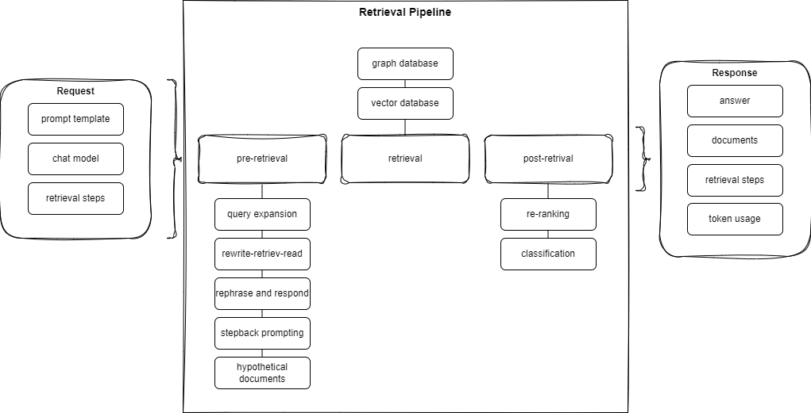

# RAG evaluation prototypes

This repository contains prototypes to evaluate RAG pipelines, as well as code to generate synthetic test data to create datasets to automatically evaluate RAG pipelines. Besides this, the repository also contains prototypes on how to provide domain knowledge to LLMs.

## Evaluation
   
The evaluation process leverages [deepeval](https://github.com/confident-ai/deepeval) and [ragas](https://github.com/explodinggradients/ragas) for assessing the performance of the RAG pipeline. Key metrics include answer relevancy, faithfulness, contextual precision, and recall. The evaluation involves comparing actual outputs from the application with expected outputs using a predefined dataset.  
   
For more detailed information on how these metrics are calculated, refer to the [deepeval](https://docs.confident-ai.com/docs/metrics-introduction) and [ragas](https://docs.ragas.io/en/stable/concepts/metrics/index.html) documentation.  
   
To run the evaluation, start the Docker container and use the `/evaluate` endpoint to submit your data. Evaluation results are stored in MongoDB, and metrics are calculated by comparing the real results with the expected ones. For more information on the evaluation process, refer to the specific notebooks and documentation within the [evaluation](./evaluation/) folder.

## RAG pipeline

To evaluate requests and responses, a RAG pipeline prototype is implemented. This prototype allows for the optimization of the RAG pipeline by testing different approaches for the pre-retrieval and post-retrieval stages. The pre-retrieval stage alters the initial query, while the post-retrieval stage enhances the retrieved documents. The pipeline can be optimized by trying different approaches for each stage.

To create different approaches, the request includes the configuration of the retrieval steps, thus describing the retrieval behaviour. The following concept overview shows the different stages of the RAG pipeline:

For more information about the different approaches and the RAG pipeline, refer to the [rag-pipeline](./rag-pipeline/) folder.

## Evaluation and Test Playground

To interactively test pipeline steps and configure the behaviour, a playground is provided. This playground can be used to interact with global settings, such as new system prompt templates and retriever configurations (e.g. the vector or graph database and its output mapping). These settings can be used to test different pipeline configurations and prompts. The chat window allows for interactive testing of the pipeline steps.

For more information on how to use the playground, refer to the [playground](./playground/) folder.
