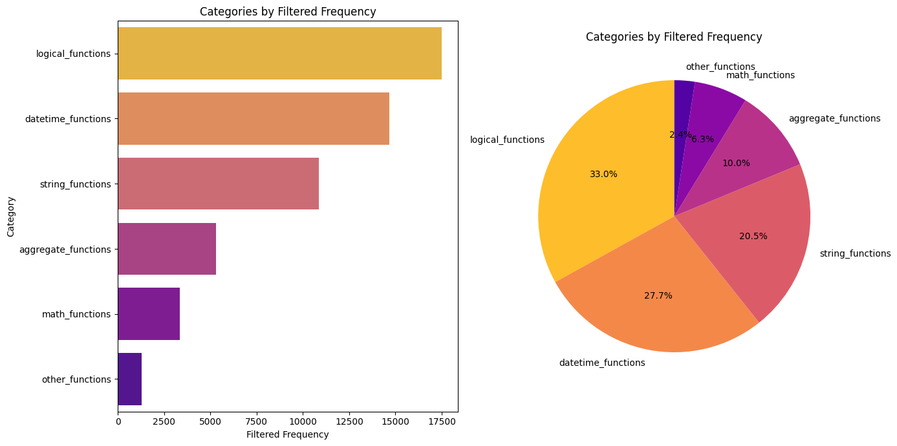
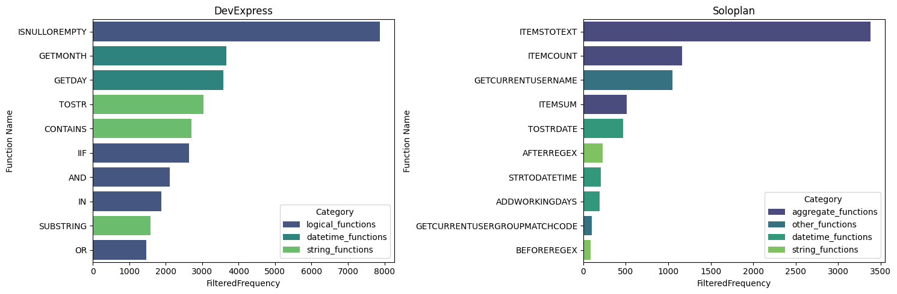
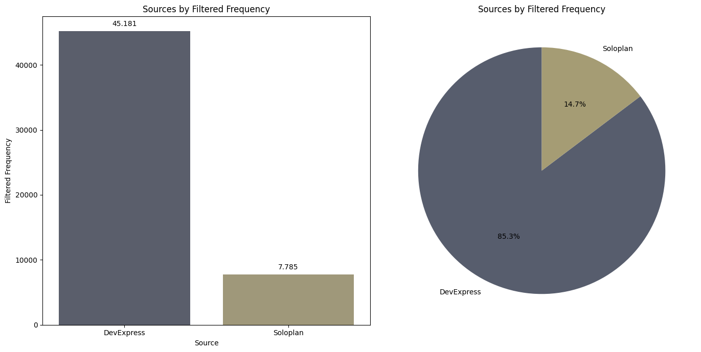

# DevExpress formulas

To properly create DevExpress formulas, certain knowledge about functions to use in the formula are required. This knowledge is extracted from two different source:

- DevExpress documentation page
- Custom formulas, extracted through explicit unit tests

The native formulas are scraped in the `scrape_devexpress_functions.ipynb` notebook. Besides textual content, metadata is created to provide category information about the function.

Previously, the formula documents had a structure like this:
```plaintext
FunctionName: []
Description: []
```

This structure was a good start, but has certain limitations. Since DevExpress provides category information for each function, as well as an example, this information can be included as metadata.
```python
class DevExpressFunction:
    name: str
    description: str
    category: str
    example: str | None = None
    source: str = "DevExpress"
```
In this case, the description is as embedding, while name, category, example, and source are metadata.

This new structure and the metadata extraction during the scraping process can be used to analyze function usage.

## Information about Workflows and Expressions

Let's look at the following example:

```xml
<BusinessObject TypePropertyId="160000">
    <OnPropertyChanged EventId="1088d43e1ca7415f9957099aa3689560" EventDescription="LKW geändert" ChangedProperty="160295">
        <SetValueByProperty ActionId="a71cf0152f8943b88a4159ed7ecd2e61" TargetProperty="160186[*]_155014_145278_5702720" ValueProperty="160009_130003"/>
        <SetValueByExpression ActionId="1c5d5790b06f497982f69a0a0cbb2fa7" TargetProperty="160186[*]_155014_145278_5702721" Expression="ItemsToText([this.160009.130011], '[First]', '[5010204]', '; ', '''''')"/>
    </OnPropertyChanged>
</BusinessObject>
```

This XML snippet contains a workflow definition. The root `TypePropertyId` accesses a `ITour` instance. Thus, calls like `this.` are used on a Tour. `TargetProperty` in the `SetValueByExpression` defines the property, that is set by the expression. The `Expression` itself is the intereseting part for DevExpress: the formula is only using one function, `ItemsToText`. The `ItemsToText` function has the following properties:

- **CollectionPropertyPath** (`[this.160009.130011]`): The path to the collection property. In this case, this accesses ``ITour.Truck.VehicleGroups``.
- **SelectorExpression** (`'[First]'`): The expression to select the items from the collection. In this case, the first item is selected.
- **ItemToStringExpression** (`'[5010204]'`): The expression to convert the item to a string. In this case, the `Designation` property of `IVehicleGroup` of the previous selected ``CollectionPropertyPath`` is used.
- **Separator** (`'; '`): The separator between the items.

All other parts of the workflow are not discussed in this context, as they are not relevant for the formula creation.

Based on this example, a few-show example for a system prompt template has been created. A request, that could lead to the formula, could look like this:

> "Create a formula, that writes all the designations of the vehicle groups of the truck of the current tour to a string separated by a semicolon."

For *good* context and reasoning, hypothetical context documents are provided aswell:
```plaintext
<formula_context>
Document 1: ItemsToText(CollectionPropertyPath, string SelectorExpression, optionalstring ItemToStringExpression, optionalstring Separator, optionalstring OrderExpression, optionalbool distinct, optionalbool IgnoreEmptyValues): Creates a textual representation of elements in a list. CollectionPropertyPath = path of the table SelectorExpression = used to select elements from the table (*, First, Last, n) ItemToStringExpression = indicates the columns to be displayed, e.g. Number Separator = separator, e.g. , (comma) OrderExpression = indicates the column by which sorting is to take place (! = reverse sequence) Distinct = from now on, only unique values are returned. IgnoreEmptyValues = empty values are not displayed.
</formula_context>
<textual_domain_knowledge>
Document 1:
Interface: ITour
Summary: Represents a tour.
Properties:
- Truck
   - Type: IVehicle
   - Description: Gets or sets the truck.

Document 2:
Interface: IVehicle
Summary: A vehicle.
Properties:
- VehicleGroups
   - Type: IVehicleGroup
   - Description: Gets the groups this vehicle belongs to.

Document 3:
Interface: IVehicleGroup
Summary: Group of vehicles.
Properties:
- Designation
   - Type: System.String
   - Description: Gets or sets the designation.
</textual_domain_knowledge>
```

These documents itself should provide enough information, to *correctly* generate a similar formula. But since the context could be rather long and the model might not directly know, what to do with the context, a reasoning description is provided aswell:
```plaintext
Use the ItemsTotext of the formula_context to create the formula. Inspect the provided textual_domain_knowledge to access the necessary properties. ITour provides "Truck", which is of type IVehicle. IVehicle contains a property called "VehicleGroups". These can be used to set the "CollectionPropertyPath" in the ItemsToText function. As the "ItemToTextExpression", use the "Designation" property of IVehicleGroup. The "Separator" should be set to a semicolon.
```

This should help the LLM, to correctly interpret the users request, as well as the provided context.

### Why were these changes made?

Previous tests showed, that the context was not interpreted properly. This can have different caused:

- context is too long (around 5-10k tokens per request), which could lead to the **Lost in the Middle** problem
- simply based on the context and the system prompt, the model is not able to know, what to do with the information
- *required* documents are not provided in the context

To ensure, that the model knows how to handle the different type of contexts, these few-shot examples with reasoning steps were created. One of the bigger problems is the fact, that *required* documents are not provided in the context. This problem can be solved or minimized by one (or a few) of the following steps:

#### Augmenting Contextual Knowledge

In this approach, a curated list list of DevExpress functions (e.g. most used functions) are pre-injected in the request and used in all requests. This might not directly solve the issue, where context is not interpreted properly, but still can help the model to construct *better* formulas.

The main reason for this approach is, that some functions are hard to retrieve, as they might not share any similarities with user requests. These could be logical or string functions, such as `ToStr` and `ItemsToText`.

The idea is to identify the customer function usage behaviour, extract the most used functions and use them as default context.

The analysis of the function usage is done in the `devexpress_analysis.ipynb` notebook. The following charts are created:


*These charts display the distribution of function categories. They are measured by the `Frequency`, which is the occurrence of the function in the customer data.*


*These charts display the top 10 functions by frequency for custom and native functions.*

These charts provide a good overview about the function usage. The `logical_functions`, `datetime_functions`and `string_functions` already make up to over **80%** of the **total function usage**. With this in mind and looking at the source distribution chart, more than **85%** of all used functions are **native functions**.


*These charts display, how the usage of the sources is distributed.*

Based on these findings, the following functions are used as default context: *this will be added later!*

It is worth mentioning, that this approach can be a solid start and probably provide a good foundation for answer generation, but it is linked with manual work, which is not ideal. But if answers are getting better using this approach, this manual review step could be done very rarely. 
*(Please note, if the custom functions are updated rarely, the manual work is not that much and the reviewing could be automatically executed!)*

#### Using Specialized Agents

This approach might be a solution to both problems. Different agents, e.g. a specialized agent in business logic could know, how to handle the context and what to extract, while a specialized DevExpress function agent could know, how to combine the context with the provided information.

The agent could also have data about function usage and could automatically inject the most used functions. These agents could also get access to tools like DevExpress function `testing`, which could directly provide the information, if the created function uses a proper syntax.

Also, each agent has its own task and thus a specific system prompt, which could already inherently lead to better results. Another advantage is, that the current research and trend goes into agent-based systems, thus this approach might be more future-proof.


*Note, that all prompt templates and its examples are currently saved in a local MongoDB instance. Later, these could be included in this repository/appendix.*