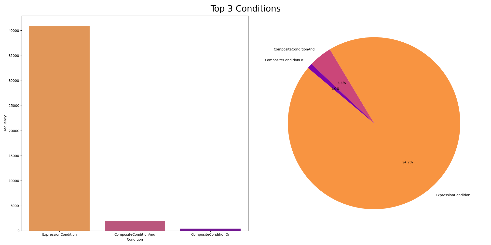
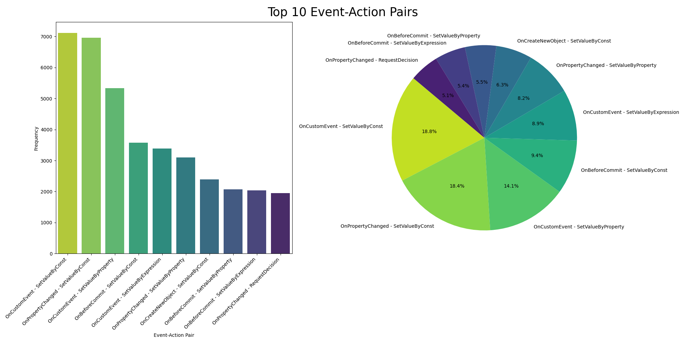

# Workflows

Workflows combine the previous research of incorporating the business logic and the expressions (DevExpress formulas). As the workflows are currently represented in XML format, the correct syntax is crucial in order to use the workflow. Thus, we have a few points to consider:

- LLMs are _bad_ in ensuring correct syntax _(as they only predict the next token)_
- workflows are deeply embedded in the core functionality, thus, in the beginning (possibly also ever), only a few events, actions and conditions will be supported
- workflows will most likely be generated in a multi-turn conversation, where the user can provide feedback and correct the workflow _(or the user did not provide enough data in the first place; thus the LLM has to ask for more information)_
- by now, no direct concept on how to provide the data to the LLM, or to be more precise: how to embed and chunk them properly, exists. This comes with some challenges, as automatically extracting the data from the codebase is hard, as the files and the logic is split up in a lot of files, inconsistant naming between the internal code and the XML-tags, and other parts. Currently, a lot of information is extracted manually and in the beginning, statically provided to the LLM!

## General information

ReAct is the low-code integration suite of CarLo, which is used to generate workflows. All information can be found [here](https://wiki.soloplan.de/wiki/doku.php?id=programming:carlo:react).

A Workflow is defined by a type of business object, an Event, when it should execute and multiple Actions that define what should happen when the Workflow is executed.

### Business Object

The root of every workflow is the business object, the event and action is “linked to” or accesses. It is referenced by the `TypePropertyId`, which contains a `PropertyPath` value.

Here is an example:

```xml
<BusinessObject TypePropertyId="145000">
<!-- Events and Actions are listed here -->
</BusinessObject>
```

This workflow accesses entries of type `IConsignment`.

### Event

A Workflow-Event listens to an event that happens in .NET CarLo. Definition file: `*IEventDefinitionViewItem`*

|  | XML-tag | Interface representation | Information | Available |
| --- | --- | --- | --- | --- |
| 1 | OnPropertyChanged |  |  | 1 |
| 2 | OnBeforeCommit |  |  | 1 |
| 3 | OnAfterCommit |  |  | 1 |
| 4 | OnCreateNewObject  | OnCreateObject |  | 1 |
| 5 | OnCustomEvent  | CustomReActEvent | inherits from CustomReActEventDefinition | 0 |
| 6 | OnCustomListEvent  | CustomReActListEvent |  | 0 |
| 7 | OnAfterBusinessObjectPrint |  |  | 0 |
| 8 | AfterReproduction  | OnAfterReproduction |  | 0 |

The base class for these events is `BusinessObjectEventDefinition`. This holds information about the business object, e.g. its PropertyId in order to access it. The base class of this, `EventDefinition`, actually has all informations about the actions of this event, its condition and variable definitions. For the workflows itself, this knowledge is not important, but for a deeper understanding of how ReAct works, this is interesting. At the end, the “root base class” is `DefinitionBase`, which contains the `Id`, information about the state (e.g. if the event is active) and a description. The real interesting part is, that this `Id` is used as `EventId` in the XML file!

Each tag has different optional and required properties, as defined here:

| Defined in | Property name | Information |
| --- | --- | --- |
| EventDefinitionXmlContentWriter | EventId  | required, as far as I know, this can be any random string; I’ve seen workflows with GUIDs and ObjectId-like (bson) ids |
|  | Mandatory  | optional |
|  | EventActive  | optional; mostly used, if the event is inactive |
|  | EventDescription | optional |
|  | Instruction  | optional |
|  | ResourceName  | optional |
|  | Condition | optional |
| OnPropertyChangedEventDefinitionXmlContentWriter  | ChangedProperty  | required, the property that changes on this event |
|  | PropertyChangeEventSource | optional, for which property changed events this should be triggered |
|  | PropertyChangeEventSourceName | optional, for which property changed events this should be triggered |
| OnBeforeCommitEventDefinitionXmlContentWriter, OnAfterCommitEventDefinitionXmlContentWriter | UpdateEvent  | optional, defaults to [insert, update]; defines the type of update that will be or was done for the business object |
| OnCustomReActEventDefinitionBaseXmlContentWriter | CustomReActEventCallUsage  | optional, defines how the event can be called |
|  | ShowParamDialog  | optional |
|  | Shortcut  | optional |
|  | ContextMenuUsage  | optional, controls the usage of the context menu, i. e. for business object or for property field |
|  | ContextMenuPropertyPath  | optional, the property path which defines for which property the context menu should be shown |
|  | ContextMenuPosition  | optional, he context menu entry where this custom ReAct event should be placed |
| OnAfterReproductionEventDefinitionXmlContentWriter | ReproductionUseCase  | optional, the use case for which this event should be executed |

A few examples to look at the different properties and how to construct workflows:

```xml
<!-- IConsignment (Sendung) -->
<BusinessObject TypePropertyId="145000">
  <OnCustomEvent
    EventId="8473f2f179b741c497279178626b3d2a"
    EventDescription="Wareneingang per Mail"
    CustomReActEventCallUsage="WithinWorkflows,ContextMenu"
    ShowParamDialog="DoNotShow"
    ContextMenuPosition="3cc71419-2a1d-451a-91de-f0ae98c7415b">
      <SendMail
        ActionId="820357cf8e784fa48a90118647de1095"
        MailTemplate="55437670"
        MailTarget="Outlook"/>
  </OnCustomEvent>
</BusinessObject>
```

The `OnCustomEvent` defines the way how the event can be called, “disables” the param dialog and also sets the context menu position. This ID is actually linked to the defined context menu entry, where this custom event has to be shown.

```xml
<!-- IConsignmentTransportPlanningStatus (Sendungsstatus) -->
<BusinessObject TypePropertyId="5715200">
  <OnAfterCommit
    EventId="0c2d4d3a-3790-4e5c-98ab-7492b0eba006"
    EventDescription="Export Status"
    Condition="[5715208.145004.500403.20005] == 18376"
    UpdateEvent="Insert">
      <AddToExportQueue
        ActionId="ea47e746-e893-4769-a60c-01edc3006e48"
        ExternalSystem="62931727"
        OperationType="Create"
        TargetTypeName="ConsignmentTransportPlanningStatus"
        ConfigurationName="KNStatusExport-v1"
        FileType="Xml">
	  <ExpressionCondition Expression="[5715208.145004.500403.20005] == 18376"/>
      </AddToExportQueue>
      <ReActGroup Id="62932848"/>
  </OnAfterCommit>
</BusinessObject>
```

This workflow does use a `Condition`, in this case an expression condition,  combined with the “insert” `UpdateEvent`. The action(s) will only execute, if the `Condition` and the correct `UpdateEvent` are met.

### Action

A Workflow-Action is what happens, when a Workflow-Event is triggered. All Actions are executed from top to bottom. The execution order can be changed in the UI. Every action has a condition, to defined, if an action should be executed. Definition file: `*IActionDefinitionViewItem*`

This is a list of actions, that can be executed:

|  | XML-tag | Interface representation | Information | Available |
| --- | --- | --- | --- | --- |
| 1 | SetValueByConst | SetValueByConstant |  | 1 |
| 2 | SetValueByProperty | SetValueByProperty |  | 1 |
| 3 | SetValueByExpression | SetValueByExpression |  | 1 |
| 4 | ShellExecute | ShellExecute |  | 0 |
| 5 | ExecuteBusinessObjectFunction | ExecuteBusinessObjectFunction |  | 0 |
| 6 | CustomSourceCode | ExecuteCustomSourceCode |  | 0 |
| 7 | ExecuteCustomEvent | ExecuteCustomReActEvent |  | 0 |
| 8 | SendMail | SendMail |  | 0 |
| 9 | CreateBusinessObject | CreateBusinessObject |  | 0 |
| 10 | PrintAction | Print |  | 0 |
| 11 | SearchInCsvFileAction | SearchInCsvFile |  | 0 |
| 12 | AddExistingBusinessObjectToCollection | AddExistingBusinessObjectToCollection |  | 0 |
| 13 | SetValueByTable | SetValueByTable |  | 0 |
| 14 | CreateUnrelatedBusinessObject | CreateUnrelatedBusinessObject |  | 0 |
| 15 | DeleteBusinessObject | DeleteBusinessObject |  | 1 |
| 16 | Wait | Wait |  | 0 |
| 17 | RequestDecision | RequestDecision |  | 0 |
| 18 | AddToExportQueue | AddToExportQueue |  | 0 |
| 19 | DistanceCalculation | DistanceCalculation |  | 0 |
| 20 | CopyFiling | CopyFiling |  | 0 |
| 21 | ValidateBusinessObject | ValidateBusinessObject |  | 0 |
| 22 | ExecuteCustomEventWithCommit | ExecuteCustomReActEventWithCommit |  | 0 |
| 23 | CallRestApi | CallRestApi |  | 0 |
| 24 | Return | Return |  | 0 |
| 25 | SendNotification | SendNotification |  | 0 |
| 26 | MultipleValueSetter | MultipleValueSetter |  | 0 |
| 27 | ExecuteReproduction | ExecuteReproduction |  | 0 |
| 29 | ShowVariablesToUser | ShowVariablesToUser |  | 0 |
| 30 | ExecuteCustomEventBeforeCommit | ExecuteCustomReActEventBeforeCommit |  | 0 |
| 31 | LucidBusinessPartnerSearch | LucidBusinessPartnerSearch |  | 0 |
| 32 | ReActFilter | ReActFilter |  | 0 |
| 33 | OutlookAppointment | OutlookAppointment |  | 0 |
| 34 | ExternalBusinessObjectExport | ExportWithExternalBusinessObject |  | 0 |
| 35 | SearchOrCreateBusinessObject | SearchOrCreateBusinessObject |  | 0 |

### Conditions

Conditions are not strictly coupled to events or actions, but are rather used in both. There are different types of conditions:

|  | XML-tag | Interface representation | Information | Available |
| --- | --- | --- | --- | --- |
| 1 | Condition  | CompositeConditionOr | Type=”OR” | 1 |
| 2 | Condition  | CompositeConditionAnd  | Type=”AND” | 1 |
| 3 | ExpressionCondition | FormulaCondition |  | 1 |
| 4 | OngoingOperationCondition | OngoingOperationCondition |  | 0 |
| 5 | FieldIsSetCondition | FieldIsSetCondition |  | 0 |
| 6 | ModuleCondition | ModuleCondition |  | 0 |
| 7 | GlobalSettingCondition | GlobalSettingCondition |  | 0 |
| 8 | FieldIsNotSetCondition | FieldIsNotSetCondition |  | 0 |

Here is an example, that includes multiple conditions.

```xml
<!-- ITransportOrder (Transportauftrag) -->
<BusinessObject TypePropertyId="155000">
  <OnPropertyChanged
    EventId="940e3f8a-cef5-4287-b598-c2274e14fc79"
    EventActive="True"
    EventDescription="+ AG 201885, Änderung LM-Buchung ..."
    ChangedProperty="5710303_5702901">
      <SetValueByConst
        ActionId="7a72796d-22d8-49b1-a96d-4b7451ec5daf"
        TargetProperty="155207_5040103"
        Value="Sender">
          <Conditions Type="AND">
            <ExpressionCondition Expression="[155306.20005] == 201885"/>
            <Conditions Type="OR">
              <ExpressionCondition Expression="[5710303.5702901.20005] == 356821 "/>
              <ExpressionCondition Expression="[5710303.5702901.20005] == 201892 "/>
              <ExpressionCondition Expression="[5710303.5702901.20005] == 3019 "  />
              <ExpressionCondition Expression="[5710303.5702901.20005] == 203610 "/>
              <ExpressionCondition Expression="[5710303.5702901.20005] == 355514 "/>
            </Conditions>
          </Conditions>
      </SetValueByConst>
  </OnPropertyChanged>
</BusinessObject>
```

### Free Action

A Workflow with the Event Free Action combines multiple actions. They can be exeucted from other Workflows by the Free Action-Action option. Free Actions can be used, to reduce duplicated definitions of business logic.

They can be called with parameters, which are set from the calling side, and are available as Variables in the Free Action. For that a variable must be added to the Free Action-Workflow and the flag Is Parameter must be set.

### Variable

Variables can be added to Workflows, as a property of the Event. They are used to pass on values to Actions of the same Workflow that are executed later. The Variables are cleared after a Workflow is executed.

A Variable can be used anywhere in ReAct, where a field of the business object would be read from or written into. The Variables are available in the property tree where the property path is selected.

## Workflow usage analysis

_Note, N=22109, where N is the amount of workflows in the dataset._

First, to get an overview of the workflows, we can look at the amount of events, actions and conditions used in the workflows. These results can be found [here](../../../data/workflows/individual_freq.csv). Based on these results, the following plots were created. These plots provide an overview about the most used events, actions and conditions in all the configured workflows.

For both the events and actions, the top 3 results make up to almost 90% of their respective category.

<!---
Note: for better results, include the amount of the events (e.g. 80.000) and actions in the plot. Also, the amount of workflows, etc. could be included somewhere.
-->

 and actions (right) in workflows")



Based on these previous insights, I was interested in seing the most used event and action combinations. Unsurprisingly, only events from the top 5 occurences are shown in these pairs. An equal outcome can be seen for the actions, with the only difference is, that they have one outlier `RequestDecision` in this list.



Besides these overarching insights, some more in-depth analysis was done. For this, the following subset has been created:

```python
top_events = df[df["type"] == "Event"].nlargest(3, "frequency")["name"].tolist()
top_actions = df[df["type"] == "Action"].nlargest(3, "frequency")["name"].tolist()
top_conditions = df[df["type"] == "Condition"].nlargest(3, "frequency")["name"].tolist()
```

This subset was used, to go over all workflows and check for all possible events and actions combinations and retrieve them. The idea was, to get a dataset with the most common event-action pair workflows, which could be used to getting started with letting the LLM generate the workflows.

But the results have shown, that over 10.000 configurations meet the criteria of the top 3 events and actions. This is actually makes a lot of sense, as the top 3 actions and events already make up almost 90% of all actions and events!

Thus, the results, that these combinations make up to 52% of all configurations, is not suprising. It is worth mentioning, that one workflow is able to have multiple actions and conditions, which is why we only get 52% of all configurations. Around 5000 of these configurations have no conditions.

Since the resulting dataset is too large, a manual subset is created, including the information from the previous section. As written in the beginning, the first tests are using static data and only _simple_ workflows are generated. This should only prove a point!
